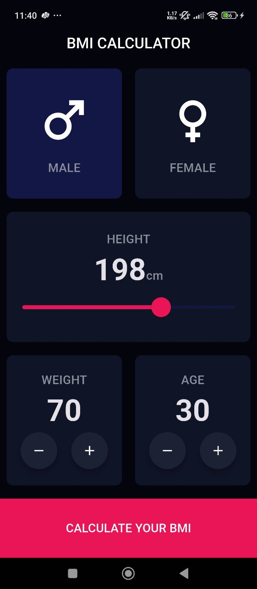
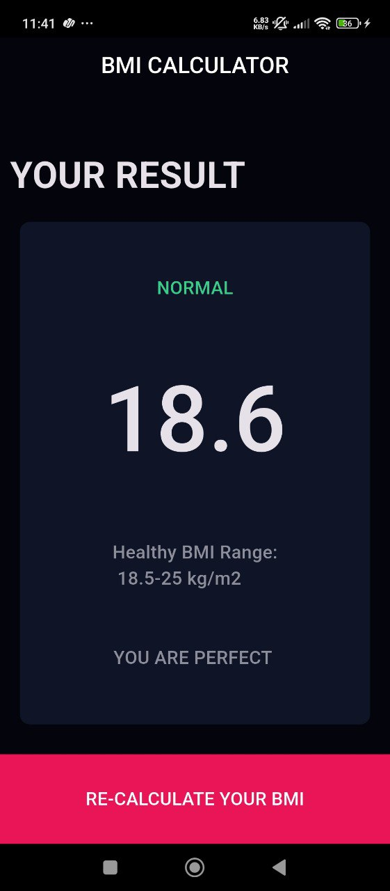

# 🧮 BMI Calculator App

A simple and elegant **Body Mass Index (BMI) Calculator** built using **Flutter**.  
This app helps users calculate their BMI based on **height**, **weight**, **age**, and **gender**, and displays the result with a clean and modern UI.

---

## 🚀 Features
- 🧔‍♂️ Gender selection (Male / Female)  
- 📏 Adjustable height slider  
- ⚖️ Weight and age increment/decrement buttons  
- 💡 Instant BMI calculation and result display  
- 🎨 Modern dark theme with beautiful UI  
- 📊 Shows BMI category and health status  

---

## 🧠 BMI Categories
| Category | BMI Range (kg/m²) |
|-----------|-------------------|
| Underweight | < 18.5 |
| Normal | 18.5 – 24.9 |
| Overweight | 25 – 29.9 |
| Obese | ≥ 30 |

---

## 📸 Screenshots
| Input Screen | Result Screen |
|---------------|---------------|
|   |  |

---

## 🛠️ Tech Stack
- **Flutter** (Dart)
- **Material Design**
- **Stateful Widgets**

---

## 💻 Installation & Run
Follow these steps to run the app locally:

```bash
# Clone the repository
git clone https://github.com/your-username/bmi-calculator.git

# Navigate into the project directory
cd bmi-calculator

# Get dependencies
flutter pub get

# Run the app
flutter run
